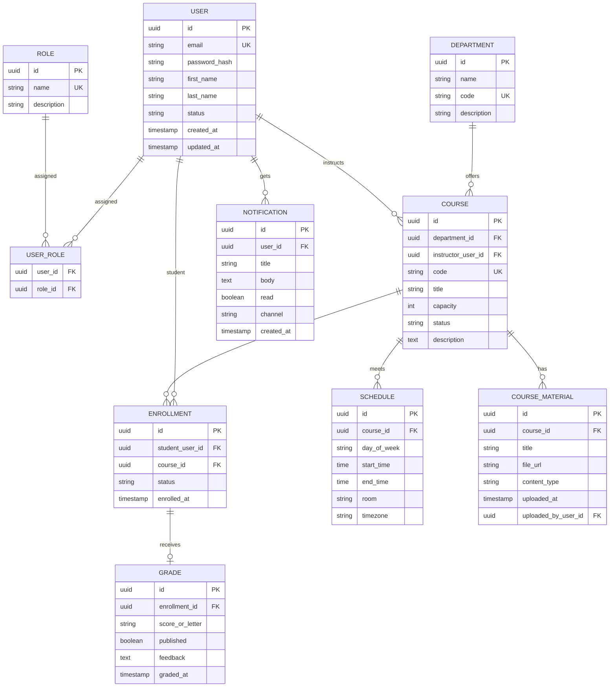

# EduPro — conceptual ER diagram

This diagram matches the REST guide modules (users, roles, departments, courses, enrollments, grades, schedules, materials, notifications). **Student** and **Instructor** are modeled as users with roles; adjust if you prefer separate profile tables.

## Mermaid (render in GitHub, VS Code, or [mermaid.live](https://mermaid.live))

## Design notes

- **Enrollment → Grade (1:0..1)** keeps grades tied to a specific enrollment row (student + course + term context). Alternative: grade keyed by `(student_id, course_id)` if you do not use an enrollment aggregate.
- **Instructor** is `USER` referenced by `COURSE.instructor_user_id`; your app enforces instructor role in the service layer (or via DB constraints if you add instructor profile tables later).
- **Flyway** scripts in `src/main/resources/db/migration/` should follow this model when you create tables.
