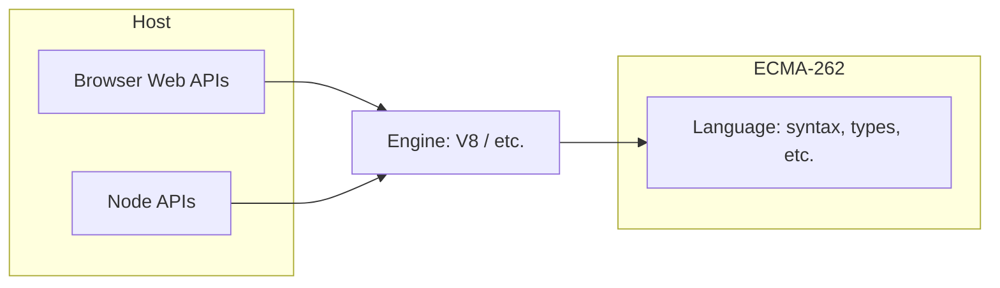

# 01 — Language, engine, and strict basics

**Keywords:** ECMAScript, V8, SpiderMonkey, JavaScript engine, **host** (browser vs Node), `"use strict"`, `let`, `const`, `var`, TDZ, hoisting.

---

## 1.1 What “JavaScript” is

- **ECMAScript (ES)** — the *language specification* (syntax and semantics). New versions are published yearly (ES2015, ES2020, …).
- **JavaScript** — a *conforming implementation* of ECMAScript. Colloquial name everyone uses.
- **Engine** — runs your code: **V8** (Chrome, Node), **SpiderMonkey** (Firefox), **JavaScriptCore** (Safari), etc.
- **Host environment** — provides extra APIs:
  - **Browser:** `document`, `fetch`, `setTimeout`, `localStorage` (from HTML/WHATWG specs, not ECMA-262).
  - **Node:** `fs`, `process`, `http` (Node’s API layer).

> **Interview line:** *“The ECMAScript spec defines the language; the host provides Web APIs or Node APIs.”*



---

## 1.2 Version naming (fixing a common old confusion)

| Name | Year | What to remember |
|------|------|------------------|
| **ES5** | 2009 | `var`, traditional functions, strict mode as opt-in |
| **ES2015 (ES6)** | 2015 | `let`/`const`, classes (syntax), modules, `Promise`, arrow functions |
| Later yearly specs | 2016+ | `async/await` (2017), optional chaining, nullish coalescing, top-level `await` in modules, etc. |

Your old note mixed “2015” with “ES5” in one line — **ES5 is not 2015**. ES2015 = ES6 = big language refresh.

---

## 1.3 Modes: sloppy vs strict

- **Strict mode** — `"use strict";` at top of script or function; catches more errors, fixes some historical quirks.
- **Module code** is strict **by default** (no need to write `"use strict"` in an ES module).

**Interview:** strict mode disallows `with`, makes `eval` stricter, and **assignment to undeclared variables throws** (in sloppy mode a global can be created by mistake).

---

## 1.4 `var` vs `let` vs `const`

| Declaration | Scope | Re-declare? | Hoisting behavior |
|-------------|--------|------------|--------------------|
| `var` | function-scoped (or global) | yes | “Hoisted” and initialized as `undefined` |
| `let` / `const` | block-scoped | no | “Hoisted” but in **TDZ** until declaration runs |

**TDZ (Temporal Dead Zone):** the period from scope entry until `let`/`const` is executed — access throws `ReferenceError`.

**`const`:** binding is fixed; for **objects**, the *reference* is constant, not deep immutability.

```js
const user = { name: "A" };
user.name = "B";   // OK
user = {};         // TypeError
```

**Default in new code:** `const` until you need reassignment, then `let`. Avoid `var` in new projects.

---

## 1.5 Truthy / falsy (interview favorite)

**Falsy** (only these): `undefined`, `null`, `false`, `0`, `NaN`, `""` (empty string), `0n` (BigInt zero).

Everything else is **truthy** (including `[]`, `{}`, `"0"`).

Use **`===` / `!==`** by default; avoid `==` unless you know the coercion table cold.

---

## 1.6 Mini Q&A

**Q: Is JavaScript compiled or interpreted?**  
A: Modern engines use **JIT compilation** (parse → bytecode/optimized machine code). Naïvely saying “only interpreted” is outdated.

**Q: Single-threaded?**  
A: **Your JS** runs on one main thread; async work is scheduled back via the **event loop** (see module 04).

---

**Next:** [02-types-references-equality](02-types-references-equality.md)
