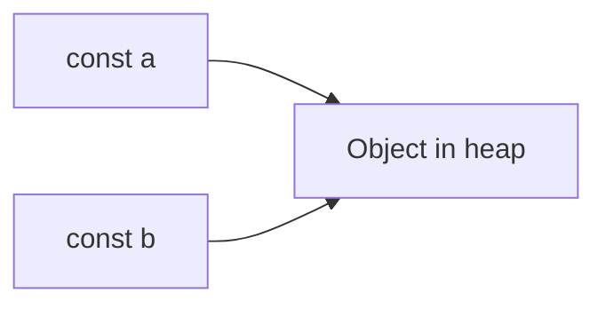

# 02 — Types, references, and equality

**Keywords:** 7 primitive types, **reference** vs **value**, **mutable** vs **immutable** (in practice), `typeof`, `Object.is`, deep vs shallow, spread/rest.

---

## 2.1 Primitives (immutable “values”)

| Type | Example |
|------|---------|
| `undefined` | declared but not assigned |
| `null` | intentional absence (legacy quirk: `typeof null === "object"`) |
| `boolean` | `true` / `false` |
| `number` | IEEE-754 double; special cases `NaN`, `±Infinity` |
| `string` | UTF-16 string values |
| `symbol` | unique keys (e.g. `Symbol.iterator`) |
| `bigint` | integers beyond `Number` safe range |

> **Unrelated to Java’s primitives:** in JS, primitives are not “boxed objects” in user code, but they have **object wrappers** (`String`, `Number`, …) used internally in some operations.

---

## 2.2 Objects and arrays (reference types)

**Object** — collection of string (or `Symbol`) keys → any value.  
**Array** — special object with ordered integer keys and `length`.

**Assignment copies the reference, not the contents:**

```js
const a = { x: 1 };
const b = a;
b.x = 2;   // a.x is 2
```

**Interview:** *“In Java, object variables hold references; in JS, the same idea applies: objects/arrays are shared unless you copy.”*



---

## 2.3 Equality: `==`, `===`, `Object.is`

- **`===`** — no coercion; use this by default.
- **`==`** — allows coercion; edge cases in interviews; avoid in production.
- **`Object.is(a,b)`** — like `===` but `Object.is(NaN, NaN)` is `true` and `+0`/`-0` differ.

**`NaN` check:** `Number.isNaN(x)` (preferred) or `Object.is(x, NaN)`.

---

## 2.4 Shallow copy vs deep copy (React-relevant)

- **Shallow:** one level. `const copy = { ...obj }` or `Object.assign({}, obj)`.
- **Nested** objects are still **shared** after shallow copy.
- **Deep** clone: `structuredClone(obj)` (modern) for data-only JSON-like trees; for full graphs, libraries or custom logic.

**React state:** you often work with **immutable updates** (new object at the changed path), not in-place mutation — module 07.

---

## 2.5 `typeof` and type checks

```js
typeof 42;           // "number"
typeof "hi";         // "string"
typeof true;         // "boolean"
typeof undefined;     // "undefined"
typeof { a: 1 };     // "object"
typeof null;         // "object"  (historical bug)
typeof [];           // "object"  (arrays are objects)
```

**Array test:** `Array.isArray(x)`.

**Null test:** `x === null`.

---

**Next:** [03-functions-scope-closures-this](03-functions-scope-closures-this.md)
