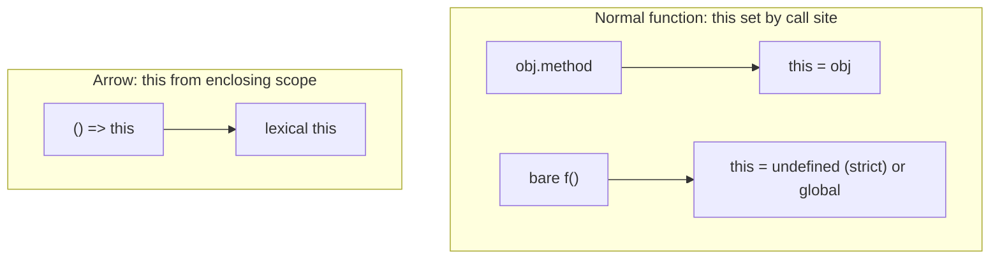

# 03 — Functions, scope, closures, and `this`

**Keywords:** function declaration vs expression, **hoisting**, **lexical scope**, **closure**, **IIFE**, `this` binding, **arrow functions** (no own `this`).

---

## 3.1 Declarations vs expressions

**Function declaration** — hoisted in full (name available in whole scope in non-module sloppy edge cases; in practice think “usable after hoisting in function scope”).

```js
function add(a, b) { return a + b; }
```

**Function expression** — assigned to a variable; name optional (named useful for stack traces).

```js
const add = function addSafe(a, b) { return a + b; };
```

**Arrow function** — concise, **lexical `this`**, not a constructor (no `new`).

```js
const add = (a, b) => a + b;
```

---

## 3.2 Lexical scope and closures

**Lexical scope** — a function “sees” variables from where it was **written**, not where it is **called** (unlike *dynamic* scope).

**Closure** — a function + its **captured** outer variables; keeps them alive for later calls or callbacks.

```js
function makeCounter() {
  let n = 0;
  return () => ++n;
}
const c = makeCounter();
c(); // 1
c(); // 2
```

**Interview:** *“A closure is a function that has access to its outer lexical environment even when invoked elsewhere.”*  
**React link:** `useState` / hooks store state in a **closure** per component invocation (conceptually).

---

## 3.3 `this` (binding rules, simplified)

`this` is **not** “where the function lives” — it is **how the function is called** (for normal functions).

| Call style | `this` (typical) |
|------------|------------------|
| `obj.method()` | `obj` |
| `f()` in sloppy mode (non-strict) | `global` / `window` (bad) |
| `f()` in strict | `undefined` |
| `new Constructor()` | new instance |
| `call` / `apply` / `bind` | first argument you pass |

**Arrow function:** `this` is **lexical** (inherits from surrounding scope) — no `call`/`apply` rebinding in the usual way.

**Interview trap:**

```js
const o = { name: "x", f() { console.log(this.name); } };
const g = o.f;
g(); // undefined or error — lost receiver
```

**Fix:** `g = o.f.bind(o)` or `f = () => o.f()`.



---

## 3.4 IIFE (historical)

Immediately Invoked Function Expression — used in ES5 for **encapsulation** before modules:

```js
(function () {
  var private = 1;
}());
```

**Today:** use **ES modules** or function scope; know IIFE for **reading old code** and **interview trivia**.

---

**Next:** [04-async-event-loop-promises](04-async-event-loop-promises.md)
