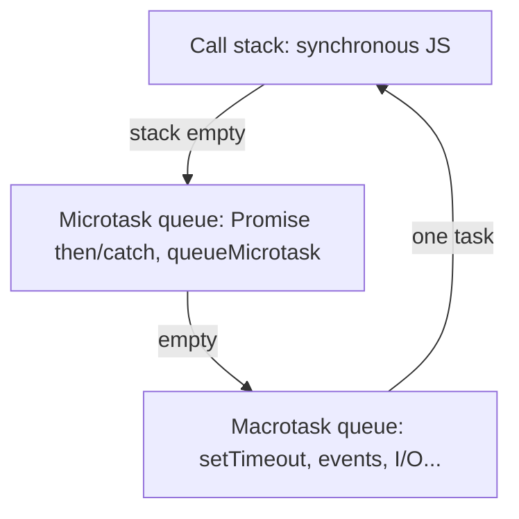

# 04 — Async: event loop, Promises, `async/await`, `fetch`

**Keywords:** **call stack**, **task (macrotask) queue**, **microtask queue**, `Promise`, `queueMicrotask`, `async/await`, `fetch`, **rejection** handling.

---

## 4.1 Why async exists (Java comparison)

- **Java** (typical web server): many **threads**; blocking I/O in one thread is fine.
- **Browser JS** main thread: one **event loop**; **long synchronous work** blocks **paint** and **input** — bad UX.
- Browsers/Node use **non-blocking** APIs (network, timers); results arrive **later** and **queue callbacks**.

**Interview one-liner:** *“JS is single-threaded for my code, but the host can run work in parallel; I schedule continuations on the event loop.”*

---

## 4.2 Event loop (simplified)

1. Run sync code on the **call stack** until empty.
2. Run **all microtasks** (Promise `.then` / `queueMicrotask`, etc.) until the microtask queue is **empty**.
3. Take one **macrotask** (timer `setTimeout`, I/O, user events, `fetch` *response in some details*) — one step per “turn” (exact ordering can be subtle; always handle Promises in microtasks first).



**Pitfall:** if you `while(true){}` the stack never unwinds; **nothing** async can run.

---

## 4.3 Promises

**State:** *pending* → *fulfilled* (value) or *rejected* (reason), **immutable** after settle.

**Always** end chains with a **catch** (or `try`/`catch` in `async`).

```js
fetch("/api/orders")
  .then((r) => {
    if (!r.ok) throw new Error(String(r.status));
    return r.json();
  })
  .then((data) => { /* use data */ })
  .catch((err) => { /* log / UI */ });
```

**Interview:** *“A Promise is a token representing eventual completion; it standardizes how we compose async work.”*

---

## 4.4 `async` / `await`

- `async function` always returns a **Promise**.
- `await` **pauses** the async function (not the whole thread) and **resumes** when the Promise settles.
- **Errors** become rejections: wrap in `try`/`catch` or `.catch`.

```js
async function load() {
  try {
    const r = await fetch("/api/orders");
    if (!r.ok) throw new Error(String(r.status));
    return await r.json();
  } catch (e) {
    console.error(e);
  }
}
```

**Parallel** requests: `const [a, b] = await Promise.all([fetchA(), fetchB()])`.

---

## 4.5 `fetch` (browser/Node 18+)

- Returns a **Promise**; first resolves on **response headers** (not fully necessarily body in all engines at same time — for HTTP, check `r.ok` and `r.status`).
- **CORS** and mixed content (HTTPS page calling HTTP) are **browser** policies — you will see “blocked by CORS” when connecting SPAs to APIs; fix at **server** headers or use **dev proxy** (see also module 06).

**Old note:** you already used `fetch` + `.then` — that pattern is still valid; modern style prefers `async/await` for readability.

---

**Next:** [05-modules-and-tooling-snapshot](05-modules-and-tooling-snapshot.md)
