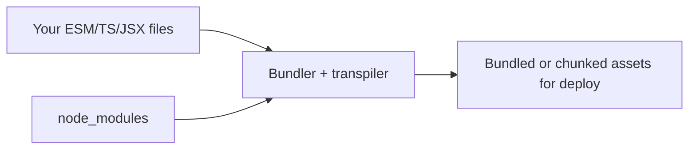

# 05 — ES modules and tooling (snapshot)

**Keywords:** `import` / `export`, **ESM** vs **CommonJS** (`require` in Node), **npm**, **bundler** (Vite, webpack, esbuild), **tree-shaking**, **transpiler** (Babel), **TypeScript** (separate language).

---

## 5.1 ES modules (what you will use in React)

**Export:**

```js
// math.js
export const PI = 3.14;
export function add(a, b) { return a + b; }
// or: export default function () {}
```

**Import:**

```js
import { add, PI } from "./math.js";
import app from "./app.js";
```

- **Static** `import` is hoisted and enables **static analysis** (tree-shaking, faster builds).
- In **browsers:** `<script type="module" src="main.js">` (strict by default, deferred).
- In **Node:** `"type": "module"` in `package.json` or `.mjs` files.

**Interview:** *“ES modules are the standard; CommonJS is legacy in Node; bundlers often accept both and emit one bundle for browsers.”*

---

## 5.2 Why bundlers exist

- Many small files, **NPM** dependencies, and **old** browsers → tools **bundle** and optionally **transpile** (e.g. downlevel syntax).
- **Vite** (very common in 2020s): fast dev with native ESM; **production build** with Rollup.
- You do **not** need to know webpack internals to start — know *what* a bundler **does** (pack + optimize) and *why* (HTTP 1.1/2 limits, compatibility).



---

## 5.3 TypeScript (positioning for your path)

- **TypeScript** is a **superset** that compiles to JavaScript; types are **erased** at compile time.
- On full-stack teams, **TS** is very common. Learning order that works: **JS fundamentals → React basics → add TS to React** (or JS first everywhere if you need velocity).

---

**Next:** [06-dom-events-and-web-apis](06-dom-events-and-web-apis.md)
