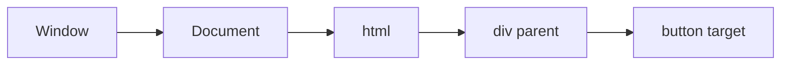

# 06 — DOM, events, and browser APIs (updated from your notes)

**Keywords:** **DOM** tree, `document.querySelector` / `getElementById`, **reflow** / **repaint**, **event propagation** (capture, target, bubble), `addEventListener`, **EventLoop** and UI, **localStorage** / **sessionStorage** / **cookies**, **CORS**, **SSRF** (for backend-JS dev awareness).

This module **compresses** your long HTML examples into **durable ideas**.

---

## 6.1 DOM: document is a tree of nodes

- **Node types:** `Element`, `Text`, `Comment`, `Document`, …
- **Prefer** stable selectors: **ids** and **data attributes** over `document.images[0]` (brittle if markup moves).

**Modern minimal pattern:**

```js
const el = document.querySelector("#app");
el.textContent = "Hello"; // text only, safe from HTML injection
// el.innerHTML = userInput; // DANGEROUS if user-controlled — XSS
```

**XSS (interview):** never assign untrusted string to `innerHTML`; use `textContent` or trusted templating/escaping (React’s default for text is safer than `innerHTML` for plain text).

---

## 6.2 Events: listen, don’t inline (for new code)

**Old style** (in your notes): `onclick="..."` — works, but **mixes** HTML and behavior.

**Preferred:**

```js
button.addEventListener("click", (ev) => {
  ev.preventDefault();  // for links/forms as needed
  // handler
}, { once: true });   // or { capture: true }
```

**Propagation:**



- **Capture phase** (down): window → target  
- **Target phase**  
- **Bubble phase** (up): target → window  

`stopPropagation()` stops both; `stopImmediatePropagation()` blocks other listeners on the same target.

**React** uses **synthetic events** and delegates many listeners to the root; still, understanding **bubbling** is what you need for the browser and for interviews.

---

## 6.3 Client-side “state” (your old section, clarified)

| Mechanism | Scope | Survives refresh | Sent to server automatically |
|----------|--------|------------------|--------------------------------|
| **query string** | shareable URL | n/a | in HTTP request (GET) |
| **sessionStorage** | one tab | until tab/window closed | no |
| **localStorage** | per origin, all tabs | until cleared | no |
| **cookie** (document) | configurable | as set | can be sent with requests if `HttpOnly` false, path/domain set — **prefer HTTP-only HttpOnly cookies for auth** from server, not for secrets in JS) |

**Security note (full-stack interview):** never put **JWT secrets** in localStorage for **XSS**-sensitive design without understanding tradeoffs; many teams use **httpOnly** cookies + CSRF strategy for **browser** clients.

**Modern URL search params:**

```js
const p = new URLSearchParams(window.location.search);
p.get("user");   // or use URL: new URL(href).searchParams
```

Storage limits: **roughly 5+ MB** per origin (browser-dependent); your old “10mb” is **approximate**.

---

## 6.4 `fetch` and CORS (the error you will see)

- **Same-origin:** page `https://a.com` → `https://a.com/api` = OK.
- **Cross-origin** `https://a.com` → `https://b.com` = browser enforces **CORS**; server must return correct `Access-Control-*` headers for browser JS to read the response.
- **Fix is usually server-side** CORS or **proxy in dev** (Vite `server.proxy`).

**You** as Java backend dev: CORS is **browser** policy, not the same as JPA or Spring Security alone — the **servlet** or gateway must add headers (or a filter).

---

## 6.5 jQuery

- **was:** write less, do more; `$(sel)`, AJAX abstraction.
- **now:** for **new** SPAs, **React** + fetch / libraries; for legacy pages, you may still see jQuery. Skim the API if you maintain old apps.

---

**Next:** [07-bridge-to-react-mental-model](07-bridge-to-react-mental-model.md)
