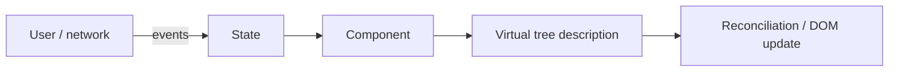

# 07 — From JavaScript to React (mental model for interviews)

**Keywords:** **declarative** UI, **reconciliation** (conceptual), **state**, **immutability**, **unidirectional** data flow, **component**, **key** in lists, **Rules of Hooks** (as outcomes of closure + scheduler).

You do **not** need every DOM method memorized to start React. You **do** need the JS ideas below.

---

## 7.1 Component = function of state (conceptually)

**Imperative** (your old notes): *find node → mutate*.

**Declarative (React):** *describe what UI should look like for given *state*; React updates the DOM.*

**Interview line:** *“I think in state and events; the library maps that to the DOM efficiently.”*

---

## 7.2 What from earlier modules actually matters

| JS topic | In React |
|----------|----------|
| **Closures** | Function components “close over” state values each render; hooks use closure **carefully** (stale state questions in interviews) |
| **Immutability** | Update with **new** objects/arrays for state, so React can detect changes (reference equality at top level) |
| **`this`** | Class components: still relevant; **function components** + hooks: less `this` |
| **Modules** | Every file is a module; `import` / `export` default and named |
| **async** | `useEffect` + `fetch` / or data libraries; handle **loading/error**; cleanup on unmount |
| **Array methods** | `.map` for list rendering, `.filter`, `.find`—every day |

**Classic interview:** *“Why use keys in a list?”*  
**A:** help React **match** which item moved/added/removed; stable ids beat array index (unless static lists).

---

## 7.3 Stale closure (hook gotcha, one paragraph)

In a `useEffect` or callback, you might “see” an **old** value if you captured it from an earlier render and did not list dependencies. **Exhaustive deps** in `useEffect` (and ESLint `react-hooks/exhaustive-deps`) exists to help—understand *why* (closure), not just the lint rule.

---

## 7.4 Not React (but asked next to it)

- **Virtual DOM** — implementation detail; interview answer: *“A lightweight in-memory description so React can diff and batch DOM updates.”*
- **React** does not replace **HTTP, REST, or JSON**; it consumes APIs like your `fetch` examples.

**Suggested first small project after theory:** a **todo** or **counter** with `useState` → add **list** with `key` → fetch **public API** in `useEffect` → show loading/error (matches your old fetch exercises but in component form later).

---

**Next:** [08-interview-keyword-checklist](08-interview-keyword-checklist.md)
